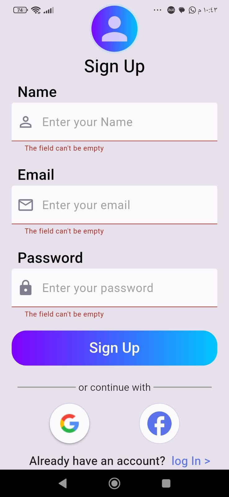

# Flutter Firebase Authentication App 🔐

A Flutter mobile application implementing a complete authentication system using Firebase Authentication and Cloud Firestore.

## ✨ Features

* 🔐 Email & Password Authentication
* 📧 Email Verification
* 🔑 Password Reset
* 🔵 Google Sign-In
* 🔷 Facebook Sign-In
* ☁️ Cloud Firestore
* 👤 User Profile & Username
* 🚪 Logout
* ✅ Form Validation
* ⚠️ Authentication Error Handling
* 🔄 Authentication State Handling

## 🛠️ Technologies

* Flutter
* Dart
* Firebase Authentication
* Cloud Firestore
* Google Sign-In
* Facebook Authentication
* Awesome Dialog

## 📱 Screenshots

### Login

[Login Page](My_photos/LoginPage.jpeg)

### Sign Up



### Home 


## 🔥 Firebase Architecture

The application uses Firebase Authentication to manage user accounts and Cloud Firestore to store additional user information.

```text
Flutter App
     │
     ├── Firebase Authentication
     │       ├── Email & Password
     │       ├── Google
     │       └── Facebook
     │
     └── Cloud Firestore
             │
             └── Users
                    └── UID
                         ├── Username
                         └── Email
```

## 🚀 Getting Started

### 1. Clone the repository

```bash
git clone YOUR_REPOSITORY_URL
```

### 2. Install dependencies

```bash
flutter pub get
```

### 3. Configure Firebase

Create your own Firebase project and configure Firebase for your Flutter application.

### 4. Run the application

```bash
flutter run
```

## 📚 What I Learned

Through this project, I practiced integrating Firebase with Flutter and gained hands-on experience with authentication flows, Firestore data management, third-party sign-in providers, form validation, error handling, and user session management.

## 👨‍💻 Author

Ziyad Mohamed
